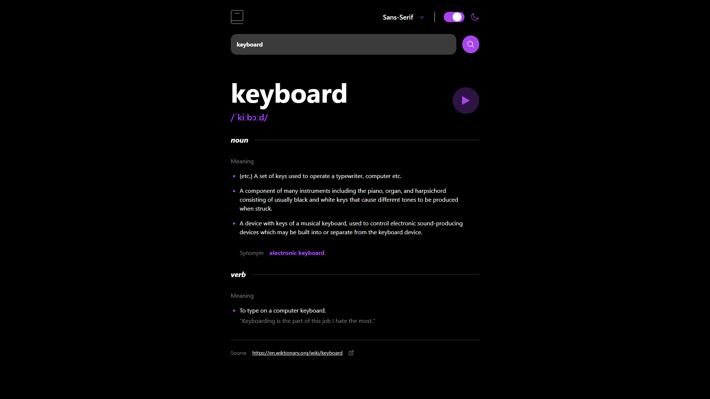

<div align="center">

  

  <h2>A simple dictionary web app</h2>

  <h3>
      <strong>Frontend Mentor</strong>
  </h3>

  <br>

  <div align="center">
    <a href="https://dictionary-web-app-by-adrian.vercel.app/">View Demo</a>
  </div>

</div>

#

<div align="center">



</div>

This is a solution to the [Dictionary web app](https://www.frontendmentor.io/challenges/dictionary-web-app-h5wwnyuKFL)). Frontend Mentor challenges help you improve your coding skills by building realistic projects.

<h2>Links</h2>

- Live Site URL: https://countries-api-by-adrian.vercel.app/
<br>

## Table of contents

- [](#)
  - [Table of contents](#table-of-contents)
  - [Overview](#overview)
    - [The challenge](#the-challenge)
  - [My process](#my-process)
    - [Built with](#built-with)
  - [Useful resources](#useful-resources)
  - [Author](#author)
  - [Run the project](#run-the-project)

## Overview

### The challenge

Users should be able to:
- Search for words using the input field
- See the Free Dictionary API's response for the searched word
- See a form validation message when trying to submit a blank form
- Play the audio file for a word when it's available
- Switch between serif, sans serif, and monospace fonts
- Switch between light and dark themes
- View the optimal layout for the interface depending on their device's screen size
- See hover and focus states for all interactive elements on the page
- Bonus: Have the correct color scheme chosen for them based on their computer preferences. Hint: Research prefers-color-scheme in CSS.

## My process

### Built with

- React.js
- Tailwind CSS
- Mobile-first workflow

## Useful resources

- [React.js](https://react.dev/)
- [Tailwind CSS](https://tailwindcss.com/)

## Author

- Frontend Mentor - [@Adrian](https://www.frontendmentor.io/profile/aliadrian)
- LinkedIn - [Adrian Nasrat](https://www.linkedin.com/in/adrian-nasrat/)

## Run the project

To run the client, you need to run the following command:

```bash
npm install
npm run start
```
